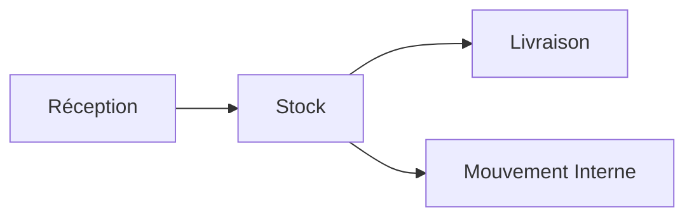

<div align="center">
  
# 🌐 SupplyChain Nexus
### La prochaine génération de gestion de chaîne d'approvisionnement

[](https://www.typescriptlang.org/)
[](https://reactjs.org/)
[](https://tailwindcss.com/)
[](https://blockchain.com)


</div>

---

## 🚀 Vision

SupplyChain Nexus révolutionne la gestion de chaîne d'approvisionnement en fusionnant la puissance de la blockchain avec une interface utilisateur futuriste. Chaque mouvement, chaque transaction, chaque produit est tracé avec une précision absolue dans un registre immuable.

## ✨ Caractéristiques

```typescript
interface Features {
  blockchain: {
    immutability: "Garantie",
    transparency: "Totale",
    security: "Maximum"
  };
  tracking: {
    precision: "Temps réel",
    history: "Complète",
    verification: "Automatique"
  };
  interface: {
    design: "Intuitif",
    responsive: true,
    darkMode: "Adaptif"
  };
}
```

## 🎯 Fonctionnalités Principales

### 📦 Gestion des Produits
- Suivi en temps réel des stocks
- Alertes de niveau bas automatiques
- Historique complet des mouvements

### 🔄 Mouvements de Stock


### 📊 Tableau de Bord
- Visualisation des données en temps réel
- Métriques de performance
- Prévisions basées sur l'IA

## 🛠 Architecture Technique

```bash
dapp-supply-chain/
├── 🔷 src/
│   ├── 🔶 blockchain/
│   │   ├── SupplyChainBlockchain.ts
│   │   └── types.ts
│   ├── 🔷 components/
│   │   ├── common/
│   │   │   ├── Button.tsx
│   │   │   ├── Input.tsx
│   │   │   └── Modal.tsx
│   │   ├── modals/
│   │   │   ├── AddProductModal.tsx
│   │   │   ├── DeliveryModal.tsx
│   │   │   └── ReceptionModal.tsx
│   │   └── ...
│   └── 🔷 utils/
│       └── generatePDF.ts
└── 📜 package.json
```

## 🚀 Installation

```bash
# Cloner le repository
git clone https://github.com/yourusername/dapp-supply-chain.git

# Installer les dépendances
cd dapp-supply-chain
npm install

# Lancer l'application
npm start
```

## 💫 Démonstration

<div align="center">
  
  
</div>

## 🎮 Guide d'Utilisation

### 1️⃣ Gestion des Produits
```typescript
// Exemple d'ajout de produit
const newProduct = {
  name: "Laptop XPS",
  minStock: 5,
  supplier: "Dell"
};
```

### 2️⃣ Mouvements de Stock
```typescript
// Exemple de réception
const reception = {
  quantity: 10,
  date: "2025-07-31",
  supplier: "Dell"
};
```

## 🔐 Sécurité

```typescript
// Exemple de block
interface Block {
  index: number;
  timestamp: number;
  data: any;
  previousHash: string;
  hash: string;
}
```

## 🌈 Interface Utilisateur

### Thème Principal
```css
:root {
  --primary: #2563eb;
  --success: #10b981;
  --warning: #f59e0b;
  --error: #ef4444;
}
```

## 📱 Responsive Design

```css
/* Mobile First Approach */
.container {
  @apply mx-auto px-4;
  @screen sm { max-width: 640px; }
  @screen md { max-width: 768px; }
  @screen lg { max-width: 1024px; }
  @screen xl { max-width: 1280px; }
}
```

## 🤝 Contribution

Nous accueillons les contributions ! Consultez notre guide de contribution pour commencer.

```typescript
interface Contributor {
  name: string;
  role: "Developer" | "Designer" | "Tester";
  contributions: string[];
}
```

## 📈 Feuille de Route

- [x] MVP Release (v1.0.0)
- [ ] Integration IA pour prévisions
- [ ] Application mobile
- [ ] API publique
- [ ] Integration IoT

## 🌟 Équipe

<div align="center">
  
| Nom | Rôle | GitHub |
|-----|------|--------|
| HAMMOUDA | Lead Developer | [@HAMMOUDAmustaphaahmed](https://github.com/HAMMOUDAmustaphaahmed) |

</div>

## 📄 Licence

MIT © 2025 HAMMOUDA mustapha ahmed

---

<div align="center">

### Made with ❤️ by HAMMOUDA mustapha ahmed

</div>
